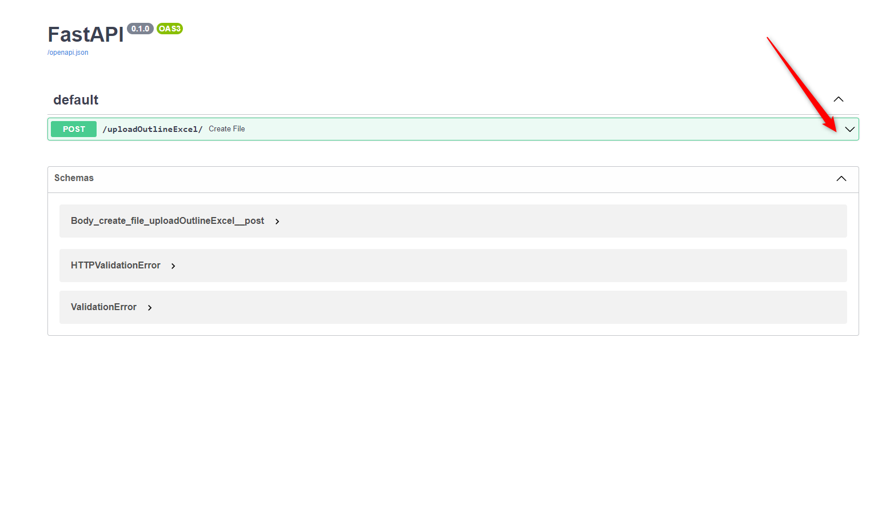
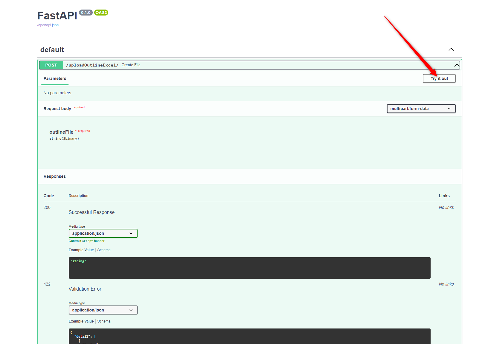
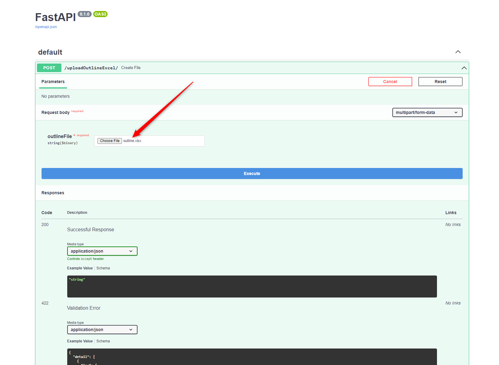
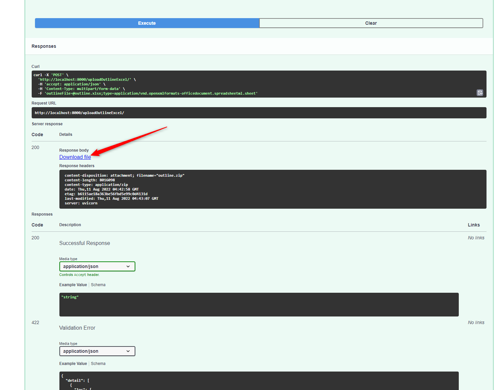

# Outlines

## Dependencies
The OS must have docker and docker-compose installed in order to run this app.

<br>
It is necessary to run the app in order for it to work 

```bash
docker-compose up
```

## How it works

To get started, you'll need [http://localhost:8000/docs](http://localhost:8000/docs) then you'll need:


<br>
<p align="center">
    
</p>
<br>
<p align="center">
    
</p>
<br>
Make sure you select outline.xlsx, Note file name must be outline.xlsx

<br>
<p align="center">    
    
</p>

<br>
<p align="center">    
    
</p>

<br>
After a while you will see 

<br>
<p align="center">    
    
</p>

The downloaded file is contain all outlines pdf and done!

